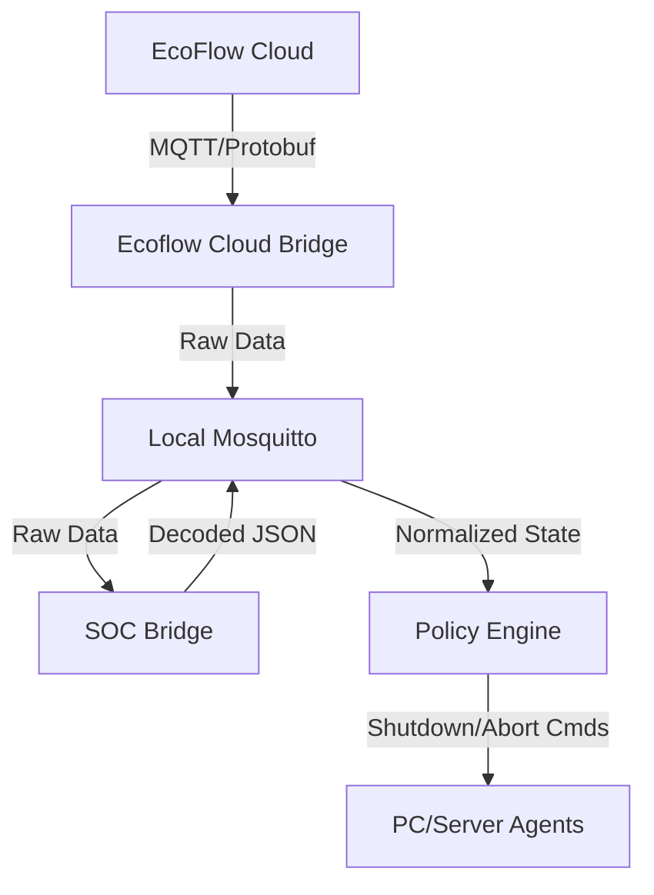

# EcoFlow Power Management Orchestrator

**A lightweight, MQTT-based power-aware shutdown system for heterogeneous environments (Linux, Windows, NAS).**

This system acts as a bridge between the proprietary EcoFlow MQTT cloud and your local infrastructure. It consumes device telemetry, derives a normalized battery State-of-Charge (SoC), and—when configurable thresholds are reached—initiates clean, host-local shutdown procedures across machines powered by those devices.

The system is intentionally:
* **Simple:** One Python file per service. No hidden frameworks.
* **Vendor-agnostic:** All coordination happens over standard MQTT.
* **Fail-safe:** No direct SSH, WinRM, or remote execution is required.
* **Host-local execution:** Each machine listens for a command and decides how to shut itself down.

---

## 🏗 System Architecture

The system runs as a collection of decoupled microservices, managed by a central **Orchestrator** (`main.py`).




### Active Services
1.  **`ecoflow_cloud_bridge`**: Connects to the EcoFlow AWS/Aliyun MQTT broker using your credentials.
2.  **`soc_bridge`**: Decodes complex Protobuf streams into normalized JSON.
    * *Feature:* **River 3 Plus** Strict Grid Detection (Tag 27) to avoid false positives.
    * *Feature:* "Imposter" packet filtering to ensure data integrity.
3.  **`policy_engine`**: The decision maker. Watches for "Critical Conditions" (Grid Lost + Low Battery) and enforces safety timers before broadcasting shutdown commands.

---

## 🚀 Installation & Setup

### Prerequisites
* Python 3.10+
* A local MQTT Broker (e.g., Mosquitto) running and accessible.

### 1. Clone & Prepare
```bash
git clone [https://github.com/your-repo/ecoflow-power-management.git](https://github.com/your-repo/ecoflow-power-management.git)
cd ecoflow-power-management
python3 -m venv venv
source venv/bin/activate
pip install -r requirements.txt
```

### 2. Configuration
Copy `.env-example` to `.env` and configure:

```bash
# Credentials
ECOFLOW_USER="email@example.com"
ECOFLOW_PASS="password"

# MQTT
MQTT_HOST="localhost"

# Policy Rules
POLICY_SOC_MIN=10            # Shutdown if Battery <= 10%
POLICY_DEBOUNCE_SEC=180      # Condition must persist for 3 minutes
POLICY_COOLDOWN_SEC=300      # Wait 5 mins before re-sending commands

# Mapping: Which Battery kills which PC Agent?
DEVICE_TO_AGENTS_JSON='{"Study": ["study-pc-agent"], "Meterkast": ["home-server-agent"]}'
```

### 3. Run
```bash
python3 main.py
```

---

## 💻 Client Agents (The Consumers)

This system follows a "Smart Source, Dumb Sink" architecture. The server logic decides *when* to shut down; the clients simply listen for the order.

### Linux Agents (Python)
For Linux hosts (servers, Raspberry Pis), use the included Python agent.
* **Location:** `agents/host_agent.py`
* **Logic:** Listens to `power-manager/<AGENT_ID>/cmd`, validates the UUID, runs `shutdown -h now`.

### Windows Agents (Native / No Python)
Windows machines do not require Python installed. You can use native PowerShell triggered by the official `mosquitto_sub.exe`.

**Recommended Approach:**
1.  Download **Mosquitto for Windows**.
2.  Create a PowerShell script `shutdown-listener.ps1`:

```powershell
# Windows Native Agent
$BROKER = "mosquitto.local"
$TOPIC = "power-manager/pc-study/cmd"

# Listen indefinitely
mosquitto_sub.exe -h $BROKER -t $TOPIC | ForEach-Object {
    $msg = $_
    Write-Host "Received Command: $msg"
    
    # Optional: Parse JSON to check for "action": "shutdown" vs "abort"
    if ($msg -match '"action":\s*"shutdown"') {
        Write-Host "Initiating Shutdown..."
        Stop-Service "Hyper-V" -Force -ErrorAction SilentlyContinue
        shutdown.exe /s /t 60 /f /c "EcoFlow Critical Battery Shutdown"
    } elseif ($msg -match '"action":\s*"abort"') {
         Write-Host "Power Restored. Aborting Shutdown."
         shutdown.exe /a
    }
}
```
3.  Run via **Task Scheduler** (At Startup, Run as SYSTEM).

---

## 🧠 Logic & Behavior

### Grid Detection (River 3 Plus)
The system uses a strict parsing logic for the River 3 Plus to avoid false positives common with heuristic methods.
* **Connected:** Protobuf Tag 27 is `0` or `1`.
* **Disconnected:** Protobuf Tag 27 is `> 1` (often `142`, `91`, or `112`).
* *Note:* Input Watts are ignored for grid status determination to prevent "Ghost Voltage" issues.

### The Policy Lifecycle
1.  **Detection:** System detects `grid_connected: false` AND `soc <= POLICY_SOC_MIN`.
2.  **Debounce:** A timer starts (default 3 mins).
    * If grid returns or SOC rises during this time, the timer **aborts**.
3.  **Trigger:** If the timer expires, a JSON `shutdown` command is published.
4.  **Recovery (Abort):** If power returns shortly after a trigger (within ~2 mins), an `abort` command is sent to cancel any pending OS shutdown operations.

---

## 🧪 Testing & Simulation

Test your policy logic without draining your actual physical batteries. We provide a simulation tool that injects fake MQTT messages.

1.  Add `"SimulatedDevice"` to your `.env` mapping:
    ```bash
    DEVICE_TO_AGENTS_JSON='{..., "SimulatedDevice": ["test-agent"]}'
    ```
2.  Run the simulation:
    ```bash
    python3 scripts/simulate_critical_event.py
    ```
3.  Watch `policy_engine` logs for "TIMER START", "SHUTDOWN TRIGGERED", and "ABORT".

---

## 🗺 Roadmap

**Phase 1: Foundation (Complete)**
* ✅ SoC decoding and normalization
* ✅ Multi-battery handling
* ✅ Read-only EcoFlow Cloud integration

**Phase 2: Logic & Control (Current)**
* ✅ Policy Engine (Debounce, Cooldown, Abort logic)
* ✅ Strict Grid Detection for River 3 Plus
* ✅ Simulation & Testing Tools

**Phase 3: Robustness (Future)**
* [ ] Startup coordination (Wake-on-LAN when power returns?)
* [ ] Capacity-weighted SoC (for multi-device setups)
* [ ] Notifications (Pushover/Telegram integration)

---

## ⛔ Non-Goals
* **No remote execution:** We do not SSH into boxes. They must subscribe to us.
* **No Windows binaries:** We do not ship `.exe` agents. Native scripts are safer and more auditable.
* **No vendor SDK dependency:** We decode the raw protobuf directly.