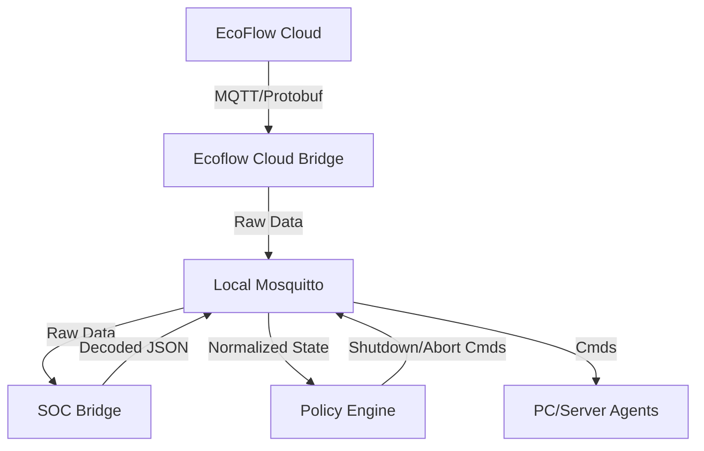

# EcoFlow Power Management Orchestrator


> **⚠️ Alpha Release:** This is an early release for testing and feedback. Please test thoroughly before using in production.

**A lightweight, MQTT-based power-aware shutdown system for heterogeneous environments (Linux, Windows, NAS).**

This system acts as a bridge between the proprietary EcoFlow MQTT cloud and your local infrastructure. It consumes device telemetry, derives a normalized battery State-of-Charge (SoC), and—when configurable thresholds are reached—initiates clean, host-local shutdown procedures across machines powered by those devices.

The system is intentionally:
* **Simple:** One Python file per service. No hidden frameworks.
* **Vendor-agnostic:** All coordination happens over standard MQTT.
* **Fail-safe:** No direct SSH, WinRM, or remote execution is required.
* **Host-local execution:** Each machine listens for a command and decides how to shut itself down.

## 📚 Documentation

- **[SETUP.md](SETUP.md)** - Complete step-by-step installation guide
- **[DOCKER.md](DOCKER.md)** - Container deployment instructions
- **[CHANGELOG.md](CHANGELOG.md)** - Version history and release notes

---

## 🚀 Quick Start

**New to this project?** Follow the complete setup guide: **[SETUP.md](SETUP.md)**

### Prerequisites

Before you begin, you need:
1. **EcoFlow Device** (tested with River 3 Plus)
2. **EcoFlow Developer API Access** ([apply here](https://developer-eu.ecoflow.com))
3. **Local MQTT Broker** (Mosquitto) - **Required for all deployments**
4. **Python 3.10+**

### 30-Second Overview

```bash
# 1. Install local MQTT broker (Mosquitto) - REQUIRED
sudo apt install mosquitto mosquitto-clients

# 2. Clone and configure
git clone https://github.com/JoshuaDodds/ecoflow-power-management.git
cd ecoflow-power-management
cp .env-example .env
# Edit .env with your credentials

# 3. Install Python dependencies and run
python3 -m venv venv && source venv/bin/activate
pip install -r requirements.txt
python3 main.py
```

**For detailed instructions, see [SETUP.md](SETUP.md)**

---

## 🏗 System Architecture

The system runs as a collection of decoupled microservices, managed by a central **Orchestrator** (`main.py`).



### Active Services
1.  **`ecoflow_cloud_bridge`**: Connects to the EcoFlow AWS/Aliyun MQTT broker using your credentials.
2.  **`soc_bridge`**: Decodes complex Protobuf streams into normalized JSON.
    * *Feature:* **River 3 Plus** Strict Grid Detection (Tag 27) to avoid false positives.
    * *Feature:* "Imposter" packet filtering to ensure data integrity.
3.  **`policy_engine`**: The decision maker. Watches for "Critical Conditions" (Grid Lost + Low Battery) and enforces safety timers before broadcasting shutdown commands.

---

## 🚀 Installation & Setup

### Prerequisites
* Python 3.10+
* A local MQTT Broker (e.g., Mosquitto) running and accessible.
* **EcoFlow Developer API credentials** (see below)

### Understanding EcoFlow API Credentials

This system uses the **EcoFlow Developer API** to connect to your devices.

#### What You Need: Developer API Credentials

- **Access Key** and **Secret Key** from the EcoFlow Developer Portal
- **Purpose:** Authenticate and obtain temporary MQTT credentials to connect to EcoFlow cloud
- **API Endpoint:** `https://api-e.ecoflow.com/iot-open/sign/certification`

The `ecoflow_cloud_bridge` service uses these credentials to:
1. Obtain temporary MQTT broker credentials
2. Connect to EcoFlow cloud MQTT
3. Send periodic "wakeup" packets (heartbeats) to keep data streaming
4. Forward device telemetry to your local MQTT broker

---

### How to Obtain Developer API Access

#### Step 1: Register for Developer Access

1. Visit the **EcoFlow Developer Portal**:
   - **EU Region:** [https://developer-eu.ecoflow.com](https://developer-eu.ecoflow.com)
   - **US Region:** [https://developer-us.ecoflow.com](https://developer-us.ecoflow.com)
   
2. Click **"Sign Up"** or **"Apply for Access"**

3. Fill out the application form with:
   - Your EcoFlow account email (same as your app login)
   - Company/Organization name (can be personal/individual)
   - Use case description (e.g., "Home automation and power monitoring")

4. Submit the application

#### Step 2: Access May Be Instant (No Waiting Required)

**Important Update (2026):** The approval process appears to be **automated** now:

- You may **not receive** a confirmation email
- You may **not receive** an "approved" notification
- **Try logging in 24 hours after applying** using your EcoFlow account credentials

Many users (including the project maintainer) have reported:
- No communication from EcoFlow after applying
- Ability to log in and create API keys immediately or after 24 hours
- No manual approval step required

#### Step 3: Generate Your API Keys

1. **Sign in** to the Developer Portal using your **EcoFlow account credentials** (same email/password as the mobile app)


2. Navigate to **"Access Key Management"** or **"API Keys"**

3. Click **"Create Access Key"** or **"Generate New Key"**

4. **Save both values immediately:**
   ```
   Access Key:  AK_xxxxxxxxxxxxxxxxxxxxxxxxxx
   Secret Key:  SK_yyyyyyyyyyyyyyyyyyyyyyyyyy
   ```

5. ⚠️ **Warning:** The Secret Key is only shown **once**. Store it securely (password manager, `.env` file, etc.)

#### Step 4: Configure Your `.env` File

Add both sets of credentials to your `.env` file:

```bash
# Cloud API Credentials (Standard Account you use to sign into the Mobile App)
ECOFLOW_USERNAME="your-email@example.com"
ECOFLOW_PASSWORD="your-password"

# Developer API Credentials (From Developer Portal)
ECOFLOW_ACCESS_KEY="AK_xxxxxxxxxxxxxxxxxxxxxxxxxx"
ECOFLOW_SECRET_KEY="SK_yyyyyyyyyyyyyyyyyyyyyyyyyy"
```

#### Troubleshooting Developer Access

**If you cannot log in after 24 hours:**
- Verify you're using the correct regional portal (EU vs US)
- Try the alternate region's portal
- Check spam/junk folders for approval emails
- Contact EcoFlow support: [https://support.ecoflow.com](https://support.ecoflow.com)

---

### 1. Clone & Prepare
```bash
git clone https://github.com/JoshuaDodds/ecoflow-power-management.git
cd ecoflow-power-management
python3 -m venv venv
source venv/bin/activate
pip install -r requirements.txt
```

### 2. Configuration
Copy `.env-example` to `.env` and configure:

```bash
# Developer API Credentials (From Developer Portal)
ECOFLOW_ACCESS_KEY="AK_xxxxxxxxxxxxxxxxxxxxxxxxxx"
ECOFLOW_SECRET_KEY="SK_yyyyyyyyyyyyyyyyyyyyyyyyyy"

# Device Serial Numbers
ECOFLOW_DEVICE_LIST="R631ZEB4WH123456,R631ZEB4WH789012"

# Local MQTT Broker
MQTT_HOST="localhost"


# Policy Rules
POLICY_SOC_MIN=10            # Shutdown if Battery <= 10%
POLICY_DEBOUNCE_SEC=180      # Condition must persist for 3 minutes
POLICY_COOLDOWN_SEC=300      # Wait 5 mins before re-sending commands

# Mapping: Which Battery kills which PC Agent?
DEVICE_TO_AGENTS_JSON='{"Study": ["study-pc-agent"], "Meterkast": ["home-server-agent"]}'
```

### 3. Run
```bash
python3 main.py
```

---

## 💻 Client Agents (The Consumers)

This system follows a **"Smart Source, Dumb Sink"** architecture. The server logic decides *when* to shut down; the clients simply listen for the order.

All agent scripts are organized by platform in the `agents/` directory:

### 📁 Agent Directory Structure
```
agents/
├── linux/          # Python-based agent for Linux systems
├── windows/        # PowerShell-based agent for Windows
└── macos/          # Bash-based agent for macOS
```

### Platform-Specific Agents

#### 🐧 Linux Agent
- **Location:** [`agents/linux/`](agents/linux/)
- **Script:** `shutdown-listener.py`
- **Requirements:** Python 3.7+, `paho-mqtt`
- **Setup:** See [Linux Agent README](agents/linux/README.md)
- **Logic:** Listens to `power-manager/<AGENT_ID>/cmd`, executes `sudo shutdown`

#### 🪟 Windows Agent
- **Location:** [`agents/windows/`](agents/windows/)
- **Script:** `shutdown-listener.ps1`
- **Requirements:** PowerShell 5.1+, [Mosquitto for Windows](https://mosquitto.org/download/)
- **Setup:** See [Windows Agent README](agents/windows/README.md)
- **Logic:** Native PowerShell script, no Python required, uses `mosquitto_sub.exe`

#### 🍎 macOS Agent
- **Location:** [`agents/macos/`](agents/macos/)
- **Script:** `shutdown-listener.sh`
- **Requirements:** Mosquitto client (`brew install mosquitto`)
- **Setup:** See [macOS Agent README](agents/macos/README.md)
- **Logic:** Bash script with MQTT listener, executes `sudo shutdown`

### Quick Start

Each platform directory contains:
- ✅ Ready-to-use agent script
- 📖 Detailed README with installation instructions
- ⚙️ Service/daemon configuration examples
- 🔧 Environment variable configuration

**Next Steps:** Navigate to your platform's directory and follow the README for installation and setup instructions.

---

## 🧠 Logic & Behavior

### Grid Detection (River 3 Plus)
The system uses a strict parsing logic for the River 3 Plus to avoid false positives common with heuristic methods.
* **Connected:** Protobuf Tag 27 is `0` or `1`.
* **Disconnected:** Protobuf Tag 27 is `> 1` (often `142`, `91`, or `112`).
* *Note:* Input Watts are ignored for grid status determination to prevent "Ghost Voltage" issues.

### The Policy Lifecycle
1.  **Detection:** System detects `grid_connected: false` AND `soc <= POLICY_SOC_MIN`.
2.  **Debounce:** A timer starts (default 3 mins).
    * If grid returns or SOC rises during this time, the timer **aborts**.
3.  **Trigger:** If the timer expires, a JSON `shutdown` command is published.
4.  **Recovery (Abort):** If power returns shortly after a trigger (within ~2 mins), an `abort` command is sent to cancel any pending OS shutdown operations.

---

## 🧪 Testing

This project includes comprehensive unit tests to ensure reliability and correctness. All tests are located in the `tests/` directory.

### Running Tests

The project uses Python's built-in `unittest` framework. No additional test dependencies are required beyond the packages in `requirements.txt`.

**Run all tests:**
```bash
python3 -m unittest discover tests
```

**Run all tests with verbose output:**
```bash
python3 -m unittest discover tests -v
```

**Run a specific test file:**
```bash
python3 -m unittest tests.test_policy_engine
python3 -m unittest tests.test_config_validation
python3 -m unittest tests.test_env_loader
```

**Run a specific test case:**
```bash
python3 -m unittest tests.test_policy_engine.TestPolicyEngineInitialization.test_empty_json_config
```

### Test Directory Structure

```
tests/
├── README.md                    # Test documentation
├── __init__.py                  # Test package initialization
├── test_config_validation.py   # Configuration validation tests
├── test_env_loader.py           # Environment variable parsing tests
├── test_policy_engine.py        # Policy engine logic tests
├── test_pushover.py             # Notification service tests
├── test_soc_filter.py           # SOC anomaly detection tests
└── test_state_filter.py         # State filtering tests
```

### Test Coverage

| Test File | Module Under Test | What It Tests |
|-----------|------------------|---------------|
| `test_config_validation.py` | `utils/config_validator.py` | Required env vars, MQTT port validation, JSON format validation, config summary generation |
| `test_env_loader.py` | `utils/env_loader.py` | Multi-line value parsing, single-line parsing, empty value handling |
| `test_policy_engine.py` | `services/policy_engine.py` | Attribute initialization, JSON config parsing, error handling, shutdown delay logic |
| `test_pushover.py` | `utils/pushover.py` | Notification formatting and delivery |
| `test_soc_filter.py` | `utils/soc_filter.py` | Anomaly detection, median filtering, confirmation windows |
| `test_state_filter.py` | `utils/state_filter.py` | Grid state filtering, transient rejection |

### Writing New Tests

When adding new features or fixing bugs, follow these testing patterns:

**1. Test file structure:**
```python
#!/usr/bin/env python3
"""
Brief description of what this test file covers.
"""
import os
import sys
import unittest

# Add parent directory to path for imports
sys.path.insert(0, os.path.dirname(os.path.dirname(os.path.abspath(__file__))))

class TestYourFeature(unittest.TestCase):
    """Test cases for your feature"""
    
    def setUp(self):
        """Setup before each test"""
        pass
    
    def tearDown(self):
        """Cleanup after each test"""
        pass
    
    def test_specific_behavior(self):
        """Test a specific behavior"""
        # Arrange
        # Act
        # Assert
        pass

if __name__ == '__main__':
    unittest.main()
```

**2. Environment variable testing:**
- Always save and restore `os.environ` in `setUp()` and `tearDown()`
- Clear relevant env vars before each test to ensure isolation
- See `test_config_validation.py` for examples

**3. Testing best practices:**
- Use descriptive test names that explain what is being tested
- Include docstrings for each test method
- Test both success and failure cases
- Test edge cases (empty strings, None values, malformed input)
- Use `self.assert*` methods for clear failure messages

### Integration Testing

For end-to-end testing of the power management logic, use the simulation tool:

```bash
# Add a simulated device to your .env
DEVICE_TO_AGENTS_JSON='{"SimulatedDevice": ["test-agent"]}'

# Run the simulation
python3 scripts/simulate_critical_event.py
```

This simulates:
- Grid disconnection
- Battery drain to critical levels
- Policy engine timer activation
- Shutdown command broadcast
- Power restoration and abort logic

Watch the logs for:
- `TIMER START` - Debounce timer activated
- `SHUTDOWN TRIGGERED` - Command sent to agents
- `ABORT` - Shutdown cancelled due to power restoration

---

## 🗺 Roadmap

**Phase 1: Foundation (Complete)**
* ✅ SoC decoding and normalization
* ✅ Multi-battery handling
* ✅ Read-only EcoFlow Cloud integration

**Phase 2: Logic & Control (Current)**
* ✅ Policy Engine (Debounce, Cooldown, Abort logic)
* ✅ Strict Grid Detection for River 3 Plus
* ✅ Simulation & Testing Tools

**Phase 3: Robustness (Future)**
* [ ] Startup coordination (Wake-on-LAN when power returns?)
* [ ] Capacity-weighted SoC (for multi-device setups)
* ✅ Notifications (Pushover/Telegram integration)

---

## ⛔ Non-Goals
* **No remote execution:** We do not SSH into boxes. They must subscribe to us.
* **No Windows binaries:** We do not ship `.exe` agents. Native scripts are safer and more auditable.
* **No vendor SDK dependency:** We decode the raw protobuf directly.

---

## 🤖 AI Collaboration Disclosure

This project was developed in collaboration with AI assistance (Google Gemini 3.0 Pro and Anthropic Claude Sonnet 4.5) to accelerate development, improve code quality, and enhance documentation. All code has been reviewed, tested, and validated by the project maintainer.

---

## Contributing

We welcome contributions! Please see our [Contributing Guide](CONTRIBUTING.md) for more details.

- **Found a bug?** Open a [Bug Report](.github/ISSUE_TEMPLATE/bug_report.md).
- **Have a feature request?** Open a [Feature Request](.github/ISSUE_TEMPLATE/feature_request.md).
- **Want to test a device?** Check the "Device Compatibility Testing" section in [CONTRIBUTING.md](CONTRIBUTING.md).

Please also read our [Code of Conduct](CODE_OF_CONDUCT.md) and [Security Policy](SECURITY.md).

## 📄 License

MIT License - see [LICENSE](LICENSE) file for details.

Copyright (c) 2026 Joshua Dodds