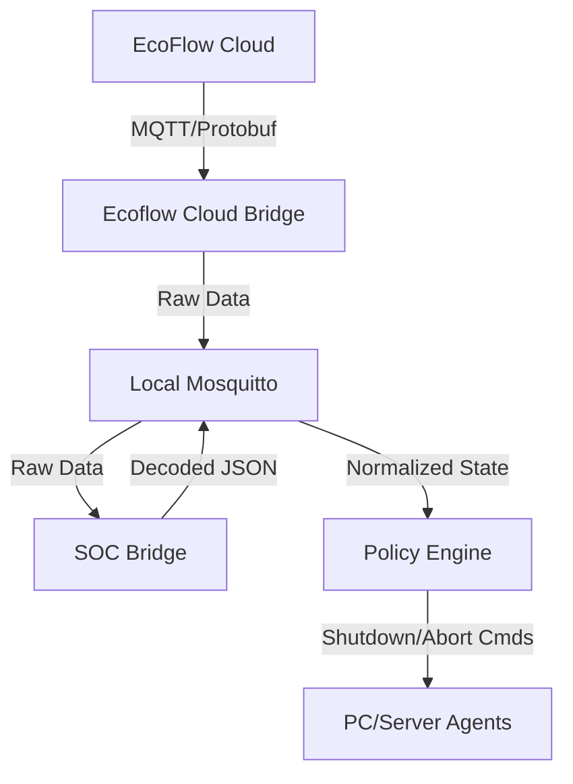

# EcoFlow Power Management Orchestrator

A robust, self-hosted middleware solution for integrating EcoFlow Power Stations (River 3 Plus, Delta Pro, etc.) into local home automation and server infrastructure.

This system acts as a bridge between the proprietary EcoFlow MQTT cloud and your local infrastructure, decoding complex Protobuf data streams into usable JSON, and acting as an intelligent **Policy Engine** to orchestrate safe server shutdowns during power outages.

---

## 🏗 System Architecture

The system runs as a collection of decoupled microservices, managed by a central **Orchestrator** (`main.py`) to ensure stability and automatic restarts.



### Core Services
1.  **`ecoflow_cloud_bridge`**: Connects to the EcoFlow AWS/Aliyun MQTT broker using your credentials. It mirrors the raw protobuf data streams to your local MQTT broker under `bridge-ecoflow/`.
2.  **`soc_bridge`**: Subscribes to the raw local streams. It uses custom decoding libraries (in `services/lib/`) to parse the binary Protobuf messages.
    * *Feature:* Implements specific logic for **River 3 Plus** (Tag 27 Grid Detection) to ensure accurate grid status reporting.
    * *Feature:* Filters out "Imposter" status messages that can corrupt data.
3.  **`policy_engine`**: The decision maker. It watches the normalized data for critical conditions (Grid Lost + Low Battery).
    * *Feature:* Enforces safety timers (Debounce) to prevent false alarms.
    * *Feature:* Sends `shutdown` commands to specific devices based on configuration.
    * *Feature:* Sends `abort` commands if power is restored before the shutdown timer expires.

---

## 🚀 Installation & Setup

### Prerequisites
* Python 3.10+
* A local MQTT Broker (e.g., Mosquitto) running and accessible.

### 1. Clone & Prepare
```bash
git clone [https://github.com/your-repo/ecoflow-power-management.git](https://github.com/your-repo/ecoflow-power-management.git)
cd ecoflow-power-management
python3 -m venv venv
source venv/bin/activate
pip install -r requirements.txt
```

### 2. Configuration
Copy the example configuration and edit it with your credentials and policy rules.

```bash
cp .env-example .env
nano .env
```

**Key `.env` Settings:**

| Setting | Description |
| :--- | :--- |
| `ECOFLOW_USER` / `PASS` | Your EcoFlow App credentials. |
| `MQTT_HOST` | IP of your local Mosquitto broker. |
| `POLICY_SOC_MIN` | **Threshold (%)**. If Battery <= this AND Grid is Lost, start shutdown timer. |
| `POLICY_DEBOUNCE_SEC` | **Safety Timer**. Condition must persist for this many seconds (e.g., 180s) before acting. |
| `DEVICE_TO_AGENTS_JSON` | **Mapping**. JSON string defining which Battery triggers which PC Agent. |

**Example Mapping:**
```bash
# This maps the EcoFlow device named "Study" to the agent listening on "power-manager/study-pc-agent/cmd"
DEVICE_TO_AGENTS_JSON='{"Study": ["study-pc-agent"], "Meterkast": ["home-server-agent"]}'
```

### 3. Running the System
Start the Orchestrator. It will launch and monitor all sub-services.

```bash
python3 main.py
```

---

## 🧠 Logic & Behavior

### Grid Detection (River 3 Plus)
The system uses a strict parsing logic for the River 3 Plus to avoid false positives common with heuristic methods.
* **Connected:** Protobuf Tag 27 is `0` or `1`.
* **Disconnected:** Protobuf Tag 27 is `> 1` (often `142`, `91`, or `112`).
* *Note:* Input Watts are ignored for grid status determination to prevent "Ghost Voltage" issues.

### The Policy Lifecycle
1.  **Detection:** System detects `grid_connected: false` AND `soc <= POLICY_SOC_MIN`.
2.  **Debounce:** A timer starts (default 3 mins).
    * If grid returns or SOC rises during this time, the timer **aborts**.
3.  **Trigger:** If the timer expires, a JSON `shutdown` command is published to the mapped agents.
4.  **Cooldown:** The system waits (default 5 mins) before sending another command to avoid spamming.
5.  **Recovery:** If power returns shortly after a trigger (within ~2 mins), an `abort` command is sent to cancel any pending OS shutdown operations.

---

## 🛠 Troubleshooting

**Q: I don't see my device in the logs.**
A: Ensure your device Serial Number (SN) and Name are correct in the EcoFlow App. The `soc_bridge` auto-discovers devices based on the traffic it sees.

**Q: The grid status is flipping rapidly.**
A: Check the `soc_bridge` logs. If you see "GRID TAG 27 DETECTED", the parser is working. Ensure `ecoflow_river3plus.py` is using the "Strict Grid Logic" version, not heuristics.

**Q: Shutdowns happen too fast.**
A: Increase `POLICY_DEBOUNCE_SEC` in your `.env`.

---

## 🧪 Testing & Simulation

You can test the Policy Engine logic without draining your actual physical batteries. We provide a simulation tool that injects fake MQTT messages.

1.  Add `"SimulatedDevice"` to your `.env` mapping:
    ```bash
    DEVICE_TO_AGENTS_JSON='{..., "SimulatedDevice": ["test-agent"]}'
    ```
2.  Run the simulation script in a separate terminal:
    ```bash
    python3 scripts/simulate_critical_event.py
    ```
3.  Watch the `policy_engine` logs for "TIMER START", "SHUTDOWN TRIGGERED", and "ABORT".

---

## 📂 Project Structure

* **`main.py`**: The Orchestrator (Entry Point).
* **`services/`**:
    * `ecoflow_cloud_bridge.py`: Cloud connection.
    * `soc_bridge.py`: Protocol decoder.
    * `policy_engine.py`: Logic & Rules.
    * `lib/`: Device-specific parsing logic (River 3, Delta Pro).
* **`agents/`**: Client-side scripts (to be installed on PCs).
* **`scripts/`**: Testing and simulation tools.