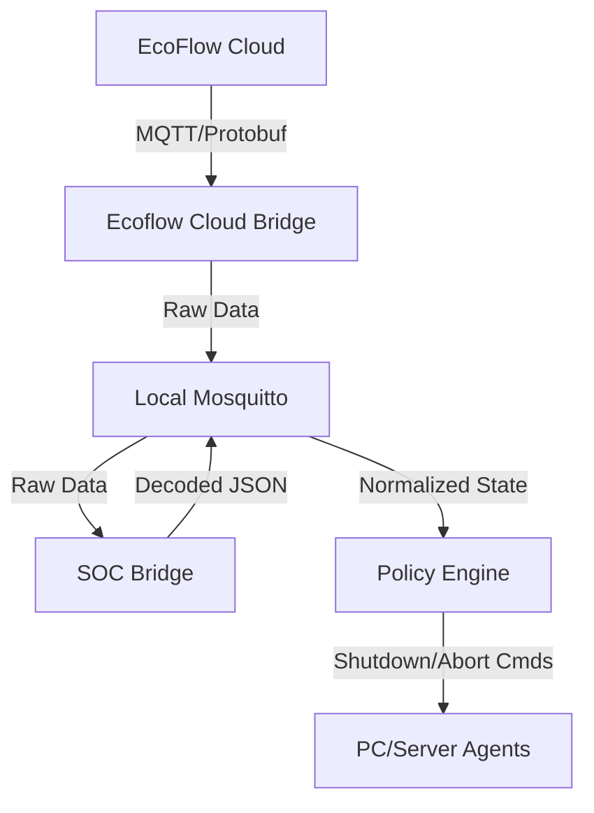

# EcoFlow Power Management Orchestrator

**A lightweight, MQTT-based power-aware shutdown system for heterogeneous environments (Linux, Windows, NAS).**

This system acts as a bridge between the proprietary EcoFlow MQTT cloud and your local infrastructure. It consumes device telemetry, derives a normalized battery State-of-Charge (SoC), and—when configurable thresholds are reached—initiates clean, host-local shutdown procedures across machines powered by those devices.

The system is intentionally:
* **Simple:** One Python file per service. No hidden frameworks.
* **Vendor-agnostic:** All coordination happens over standard MQTT.
* **Fail-safe:** No direct SSH, WinRM, or remote execution is required.
* **Host-local execution:** Each machine listens for a command and decides how to shut itself down.

---

## 🏗 System Architecture

The system runs as a collection of decoupled microservices, managed by a central **Orchestrator** (`main.py`).




### Active Services
1.  **`ecoflow_cloud_bridge`**: Connects to the EcoFlow AWS/Aliyun MQTT broker using your credentials.
2.  **`soc_bridge`**: Decodes complex Protobuf streams into normalized JSON.
    * *Feature:* **River 3 Plus** Strict Grid Detection (Tag 27) to avoid false positives.
    * *Feature:* "Imposter" packet filtering to ensure data integrity.
3.  **`policy_engine`**: The decision maker. Watches for "Critical Conditions" (Grid Lost + Low Battery) and enforces safety timers before broadcasting shutdown commands.

---

## 🚀 Installation & Setup

### Prerequisites
* Python 3.10+
* A local MQTT Broker (e.g., Mosquitto) running and accessible.
* **Both** EcoFlow Cloud API credentials AND Developer API credentials (see below)

### Understanding EcoFlow API Credentials

This system requires **TWO sets of credentials** to maintain a reliable, continuous MQTT connection to EcoFlow's cloud infrastructure:

#### 1. Cloud API Credentials (Username & Password)
- **What:** Your standard EcoFlow account email and password
- **Purpose:** Used to authenticate and obtain temporary MQTT broker certificates
- **API Endpoint:** `https://api.ecoflow.com/auth/login` → `/iot-auth/app/certification`
- **Limitation:** These credentials alone are **not sufficient** for reliable operation

#### 2. Developer API Credentials (Access Key & Secret Key)
- **What:** API keys from the EcoFlow Developer Portal
- **Purpose:** Required to send periodic "wakeup" packets (heartbeats) to keep the MQTT connection alive and streaming data
- **API Endpoint:** `https://api-e.ecoflow.com/iot-open/sign/certification`
- **Critical:** Without these, the MQTT broker connection will go silent after a few minutes

#### Why Both Are Needed

The EcoFlow MQTT broker requires **active heartbeat packets** to continue streaming device telemetry. Without periodic wakeup commands:
- The connection appears established but **stops sending data**
- No error messages are generated—the stream simply goes silent
- The system cannot detect battery state changes or trigger shutdown policies

The Developer API credentials enable the `ecoflow_cloud_bridge` service to:
1. Authenticate using the signed API request format
2. Send protobuf-encoded "Cmd 0" (quota/get-all) packets every 5 minutes
3. Keep the data stream flowing continuously

**In summary:** Cloud credentials get you connected; Developer credentials keep you connected.

---

### How to Obtain Developer API Access

#### Step 1: Register for Developer Access

1. Visit the **EcoFlow Developer Portal**:
   - **EU Region:** [https://developer-eu.ecoflow.com](https://developer-eu.ecoflow.com)
   - **US Region:** [https://developer-us.ecoflow.com](https://developer-us.ecoflow.com)
   
2. Click **"Sign Up"** or **"Apply for Access"**

3. Fill out the application form with:
   - Your EcoFlow account email (same as your app login)
   - Company/Organization name (can be personal/individual)
   - Use case description (e.g., "Home automation and power monitoring")

4. Submit the application

#### Step 2: Access May Be Instant (No Waiting Required)

**Important Update (2026):** The approval process appears to be **automated** now:

- You may **not receive** a confirmation email
- You may **not receive** an "approved" notification
- **Try logging in 24 hours after applying** using your EcoFlow account credentials

Many users (including the project maintainer) have reported:
- No communication from EcoFlow after applying
- Ability to log in and create API keys immediately after 24 hours
- No manual approval step required

#### Step 3: Generate Your API Keys

1. **Sign in** to the Developer Portal using your **EcoFlow account credentials** (same email/password as the mobile app)

2. Navigate to **"Access Key Management"** or **"API Keys"**

3. Click **"Create Access Key"** or **"Generate New Key"**

4. **Save both values immediately:**
   ```
   Access Key:  AK_xxxxxxxxxxxxxxxxxxxxxxxxxx
   Secret Key:  SK_yyyyyyyyyyyyyyyyyyyyyyyyyy
   ```

5. ⚠️ **Warning:** The Secret Key is only shown **once**. Store it securely (password manager, `.env` file, etc.)

#### Step 4: Configure Your `.env` File

Add both sets of credentials to your `.env` file:

```bash
# Cloud API Credentials (Standard Account)
ECOFLOW_USERNAME="your-email@example.com"
ECOFLOW_PASSWORD="your-password"

# Developer API Credentials (From Developer Portal)
ECOFLOW_ACCESS_KEY="AK_xxxxxxxxxxxxxxxxxxxxxxxxxx"
ECOFLOW_SECRET_KEY="SK_yyyyyyyyyyyyyyyyyyyyyyyyyy"
```

#### Troubleshooting Developer Access

**If you cannot log in after 24 hours:**
- Verify you're using the correct regional portal (EU vs US)
- Try the alternate region's portal
- Check spam/junk folders for approval emails
- Contact EcoFlow support: [https://support.ecoflow.com](https://support.ecoflow.com)

**If the bridge fails to authenticate:**
- Verify your Access Key starts with `AK_`
- Verify your Secret Key starts with `SK_`
- Check for extra spaces or quotes in your `.env` file
- Ensure you're using the Developer API keys, not MQTT certificates

---

### 1. Clone & Prepare
```bash
git clone [https://github.com/your-repo/ecoflow-power-management.git](https://github.com/your-repo/ecoflow-power-management.git)
cd ecoflow-power-management
python3 -m venv venv
source venv/bin/activate
pip install -r requirements.txt
```

### 2. Configuration
Copy `.env-example` to `.env` and configure:

```bash
# Cloud API Credentials (Standard Account)
ECOFLOW_USERNAME="your-email@example.com"
ECOFLOW_PASSWORD="your-password"

# Developer API Credentials (From Developer Portal)
ECOFLOW_ACCESS_KEY="AK_xxxxxxxxxxxxxxxxxxxxxxxxxx"
ECOFLOW_SECRET_KEY="SK_yyyyyyyyyyyyyyyyyyyyyyyyyy"

# Device Serial Numbers
ECOFLOW_DEVICE_LIST="R631ZEB4WH123456,R631ZEB4WH789012"

# Local MQTT Broker
MQTT_HOST="localhost"

# Policy Rules
POLICY_SOC_MIN=10            # Shutdown if Battery <= 10%
POLICY_DEBOUNCE_SEC=180      # Condition must persist for 3 minutes
POLICY_COOLDOWN_SEC=300      # Wait 5 mins before re-sending commands

# Mapping: Which Battery kills which PC Agent?
DEVICE_TO_AGENTS_JSON='{"Study": ["study-pc-agent"], "Meterkast": ["home-server-agent"]}'
```

### 3. Run
```bash
python3 main.py
```

---

## 💻 Client Agents (The Consumers)

This system follows a **"Smart Source, Dumb Sink"** architecture. The server logic decides *when* to shut down; the clients simply listen for the order.

All agent scripts are organized by platform in the `agents/` directory:

### 📁 Agent Directory Structure
```
agents/
├── linux/          # Python-based agent for Linux systems
├── windows/        # PowerShell-based agent for Windows
└── macos/          # Bash-based agent for macOS
```

### Platform-Specific Agents

#### 🐧 Linux Agent
- **Location:** [`agents/linux/`](agents/linux/)
- **Script:** `shutdown-listener.py`
- **Requirements:** Python 3.7+, `paho-mqtt`
- **Setup:** See [Linux Agent README](agents/linux/README.md)
- **Logic:** Listens to `power-manager/<AGENT_ID>/cmd`, executes `sudo shutdown`

#### 🪟 Windows Agent
- **Location:** [`agents/windows/`](agents/windows/)
- **Script:** `shutdown-listener.ps1`
- **Requirements:** PowerShell 5.1+, [Mosquitto for Windows](https://mosquitto.org/download/)
- **Setup:** See [Windows Agent README](agents/windows/README.md)
- **Logic:** Native PowerShell script, no Python required, uses `mosquitto_sub.exe`

#### 🍎 macOS Agent
- **Location:** [`agents/macos/`](agents/macos/)
- **Script:** `shutdown-listener.sh`
- **Requirements:** Mosquitto client (`brew install mosquitto`)
- **Setup:** See [macOS Agent README](agents/macos/README.md)
- **Logic:** Bash script with MQTT listener, executes `sudo shutdown`

### Quick Start

Each platform directory contains:
- ✅ Ready-to-use agent script
- 📖 Detailed README with installation instructions
- ⚙️ Service/daemon configuration examples
- 🔧 Environment variable configuration

**Next Steps:** Navigate to your platform's directory and follow the README for installation and setup instructions.

---

## 🧠 Logic & Behavior

### Grid Detection (River 3 Plus)
The system uses a strict parsing logic for the River 3 Plus to avoid false positives common with heuristic methods.
* **Connected:** Protobuf Tag 27 is `0` or `1`.
* **Disconnected:** Protobuf Tag 27 is `> 1` (often `142`, `91`, or `112`).
* *Note:* Input Watts are ignored for grid status determination to prevent "Ghost Voltage" issues.

### The Policy Lifecycle
1.  **Detection:** System detects `grid_connected: false` AND `soc <= POLICY_SOC_MIN`.
2.  **Debounce:** A timer starts (default 3 mins).
    * If grid returns or SOC rises during this time, the timer **aborts**.
3.  **Trigger:** If the timer expires, a JSON `shutdown` command is published.
4.  **Recovery (Abort):** If power returns shortly after a trigger (within ~2 mins), an `abort` command is sent to cancel any pending OS shutdown operations.

---

## 🧪 Testing & Simulation

Test your policy logic without draining your actual physical batteries. We provide a simulation tool that injects fake MQTT messages.

1.  Add `"SimulatedDevice"` to your `.env` mapping:
    ```bash
    DEVICE_TO_AGENTS_JSON='{..., "SimulatedDevice": ["test-agent"]}'
    ```
2.  Run the simulation:
    ```bash
    python3 scripts/simulate_critical_event.py
    ```
3.  Watch `policy_engine` logs for "TIMER START", "SHUTDOWN TRIGGERED", and "ABORT".

---

## 🗺 Roadmap

**Phase 1: Foundation (Complete)**
* ✅ SoC decoding and normalization
* ✅ Multi-battery handling
* ✅ Read-only EcoFlow Cloud integration

**Phase 2: Logic & Control (Current)**
* ✅ Policy Engine (Debounce, Cooldown, Abort logic)
* ✅ Strict Grid Detection for River 3 Plus
* ✅ Simulation & Testing Tools

**Phase 3: Robustness (Future)**
* [ ] Startup coordination (Wake-on-LAN when power returns?)
* [ ] Capacity-weighted SoC (for multi-device setups)
* [ ] Notifications (Pushover/Telegram integration)

---

## ⛔ Non-Goals
* **No remote execution:** We do not SSH into boxes. They must subscribe to us.
* **No Windows binaries:** We do not ship `.exe` agents. Native scripts are safer and more auditable.
* **No vendor SDK dependency:** We decode the raw protobuf directly.