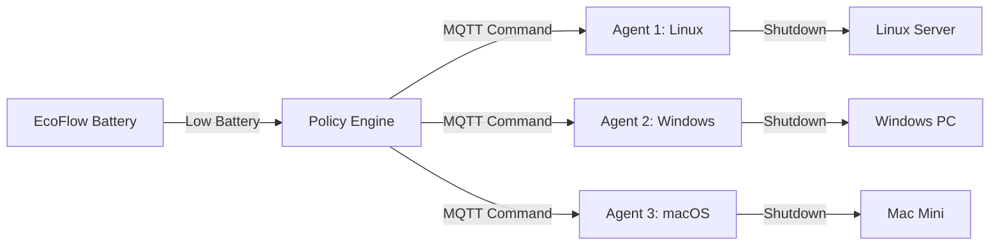

# Agent Configuration Guide

This guide explains how to configure and deploy agents across multiple machines with different operating systems.

## Architecture Overview

### How the System Works



### Component Roles

1. **Policy Engine** (Server-side - runs on one machine):
   - Monitors EcoFlow battery states
   - Decides when to trigger shutdowns
   - Publishes commands to MQTT topics

2. **Agents** (Client-side - runs on each machine to be protected):
   - Subscribes to its own MQTT topic
   - Executes pre-shutdown commands
   - Performs system shutdown

---

## Configuration Mapping

### Server Configuration (`.env`)

The server uses `DEVICE_TO_AGENTS_JSON` to map batteries to agents:

```bash
DEVICE_TO_AGENTS_JSON={"Study":["pc-study","nas-study"],"Office":["pc-office"]}
```

**Explanation:**
- When the **"Study"** battery is critical → shutdown **pc-study** AND **nas-study**
- When the **"Office"** battery is critical → shutdown **pc-office**

### Agent Configuration

Each agent must set its `AGENT_ID` to match the mapping:

| Machine | AGENT_ID | Protected By |
|---------|----------|--------------|
| Study Desktop | `pc-study` | Study battery |
| Study NAS | `nas-study` | Study battery |
| Office PC | `pc-office` | Office battery |

---

## Agent Configuration Variables

All agents support the same environment variables:

### Required Variables

| Variable | Description | Example |
|----------|-------------|---------|
| `AGENT_ID` | Unique identifier (must match server mapping) | `pc-study` |
| `MQTT_BROKER` | MQTT broker hostname or IP | `mosquitto.local` |
| `MQTT_PORT` | MQTT broker port | `1883` |

### Optional Variables

| Variable | Description | Default |
|----------|-------------|---------|
| `PRE_SHUTDOWN_CMD_1` | First command to run before shutdown | _(none)_ |
| `PRE_SHUTDOWN_CMD_2` | Second command to run before shutdown | _(none)_ |
| `PRE_SHUTDOWN_CMD_3` | Third command to run before shutdown | _(none)_ |
| ... | Up to 9 pre-shutdown commands | _(none)_ |
| `SHUTDOWN_CMD` | Custom shutdown command | Platform-specific |
| `ABORT_CMD` | Custom abort command | Platform-specific |

---

## Platform-Specific Examples

### Linux Agent

#### systemd Service Configuration

Create `/etc/systemd/system/ecoflow-agent.service`:

```ini
[Unit]
Description=EcoFlow Power Management Agent
After=network.target

[Service]
Type=simple
User=root
Environment="MQTT_BROKER=mosquitto.local"
Environment="AGENT_ID=pc-study"
Environment="PRE_SHUTDOWN_CMD_1=docker stop $(docker ps -q)"
Environment="PRE_SHUTDOWN_CMD_2=systemctl stop microk8s"
ExecStart=/usr/bin/python3 /opt/ecoflow/agents/linux/shutdown-listener.py
Restart=always
RestartSec=10

[Install]
WantedBy=multi-user.target
```

#### Common Pre-Shutdown Commands

```bash
# Stop Docker containers
PRE_SHUTDOWN_CMD_1="docker stop $(docker ps -q)"

# Stop Kubernetes
PRE_SHUTDOWN_CMD_2="systemctl stop microk8s"

# Stop databases
PRE_SHUTDOWN_CMD_3="systemctl stop postgresql"

# Sync filesystems
PRE_SHUTDOWN_CMD_4="sync"
```

---

### Windows Agent

#### Environment Variables (PowerShell)

```powershell
# Set system-wide environment variables (requires Administrator)
[System.Environment]::SetEnvironmentVariable('AGENT_ID', 'pc-office', 'Machine')
[System.Environment]::SetEnvironmentVariable('MQTT_BROKER', 'mosquitto.local', 'Machine')
[System.Environment]::SetEnvironmentVariable('PRE_SHUTDOWN_CMD_1', 'Stop-Service -Name vmms -Force', 'Machine')
[System.Environment]::SetEnvironmentVariable('PRE_SHUTDOWN_CMD_2', 'docker stop $(docker ps -q)', 'Machine')
```

#### Task Scheduler Configuration

When creating the scheduled task, add environment variables in the action arguments:

```powershell
# Program: powershell.exe
# Arguments:
-ExecutionPolicy Bypass -Command "
  $env:AGENT_ID='pc-office';
  $env:MQTT_BROKER='mosquitto.local';
  $env:PRE_SHUTDOWN_CMD_1='Stop-Service -Name vmms -Force';
  & 'C:\path\to\agents\windows\shutdown-listener.ps1'
"
```

#### Common Pre-Shutdown Commands

```powershell
# Stop Hyper-V VMs
PRE_SHUTDOWN_CMD_1="Stop-Service -Name 'vmms' -Force"

# Stop Docker containers
PRE_SHUTDOWN_CMD_2="docker stop $(docker ps -q)"

# Stop specific services
PRE_SHUTDOWN_CMD_3="Stop-Service -Name 'MyService' -Force"
```

---

### macOS Agent

#### LaunchDaemon Configuration

Create `/Library/LaunchDaemons/com.ecoflow.agent.plist`:

```xml
<?xml version="1.0" encoding="UTF-8"?>
<!DOCTYPE plist PUBLIC "-//Apple//DTD PLIST 1.0//EN" "http://www.apple.com/DTDs/PropertyList-1.0.dtd">
<plist version="1.0">
<dict>
    <key>Label</key>
    <string>com.ecoflow.agent</string>
    
    <key>ProgramArguments</key>
    <array>
        <string>/opt/ecoflow/agents/macos/shutdown-listener.sh</string>
    </array>
    
    <key>EnvironmentVariables</key>
    <dict>
        <key>MQTT_BROKER</key>
        <string>mosquitto.local</string>
        <key>AGENT_ID</key>
        <string>mac-studio</string>
        <key>PRE_SHUTDOWN_CMD_1</key>
        <string>docker stop $(docker ps -q)</string>
        <key>PRE_SHUTDOWN_CMD_2</key>
        <string>brew services stop postgresql</string>
    </dict>
    
    <key>RunAtLoad</key>
    <true/>
    
    <key>KeepAlive</key>
    <true/>
    
    <key>StandardOutPath</key>
    <string>/var/log/ecoflow-agent.log</string>
    
    <key>StandardErrorPath</key>
    <string>/var/log/ecoflow-agent.error.log</string>
</dict>
</plist>
```

#### Common Pre-Shutdown Commands

```bash
# Stop Docker containers
PRE_SHUTDOWN_CMD_1="docker stop $(docker ps -q)"

# Stop Homebrew services
PRE_SHUTDOWN_CMD_2="brew services stop postgresql"

# Unmount network drives
PRE_SHUTDOWN_CMD_3="umount /Volumes/NetworkDrive"
```

---

## Multi-Agent Setup Example

### Scenario

You have:
- 1 EcoFlow battery in your study (named "Study" in the app)
- 3 machines powered by it:
  - Linux server running Docker
  - Windows PC running Hyper-V
  - macOS workstation

### Server Configuration

```bash
# .env file
DEVICE_TO_AGENTS_JSON={"Study":["linux-server","windows-pc","mac-workstation"]}
```

### Agent Configurations

#### Linux Server
```bash
AGENT_ID=linux-server
MQTT_BROKER=mosquitto.local
PRE_SHUTDOWN_CMD_1="docker stop $(docker ps -q)"
```

#### Windows PC
```powershell
$env:AGENT_ID = "windows-pc"
$env:MQTT_BROKER = "mosquitto.local"
$env:PRE_SHUTDOWN_CMD_1 = "Stop-Service -Name 'vmms' -Force"
```

#### macOS Workstation
```bash
AGENT_ID=mac-workstation
MQTT_BROKER=mosquitto.local
PRE_SHUTDOWN_CMD_1="osascript -e 'quit app \"Final Cut Pro\"'"
```

---

## Testing Your Configuration

### 1. Test MQTT Connection

On each agent machine, verify MQTT connectivity:

```bash
# Linux/macOS
mosquitto_sub -h mosquitto.local -t "power-manager/YOUR_AGENT_ID/cmd" -v

# Windows
mosquitto_sub.exe -h mosquitto.local -t "power-manager/YOUR_AGENT_ID/cmd" -v
```

### 2. Send Test Command

From the server or any machine:

```bash
# Test shutdown command (won't actually shutdown with default delays)
mosquitto_pub -h mosquitto.local \
  -t "power-manager/YOUR_AGENT_ID/cmd" \
  -m '{"action":"shutdown","reason":"test"}'

# Test abort command
mosquitto_pub -h mosquitto.local \
  -t "power-manager/YOUR_AGENT_ID/cmd" \
  -m '{"action":"abort","reason":"test"}'
```

### 3. Check Agent Logs

Monitor agent output to verify commands are received and executed:

```bash
# Linux systemd
journalctl -u ecoflow-agent -f

# Windows Task Scheduler
# Check task history in Task Scheduler

# macOS LaunchDaemon
tail -f /var/log/ecoflow-agent.log
```

---

## Troubleshooting

### Agent Not Receiving Commands

1. **Check MQTT broker is running:**
   ```bash
   mosquitto_sub -h mosquitto.local -t '#' -v
   ```

2. **Verify AGENT_ID matches server mapping:**
   - Check `.env` file `DEVICE_TO_AGENTS_JSON`
   - Check agent's `AGENT_ID` environment variable

3. **Check network connectivity:**
   ```bash
   ping mosquitto.local
   ```

### Pre-Shutdown Commands Not Running

1. **Check environment variables are set:**
   - Linux: `echo $PRE_SHUTDOWN_CMD_1`
   - Windows: `$env:PRE_SHUTDOWN_CMD_1`
   - macOS: `echo $PRE_SHUTDOWN_CMD_1`

2. **Test commands manually:**
   - Run each command individually to verify syntax

3. **Check agent logs for error messages**

### Shutdown Not Executing

1. **Verify sudo/admin permissions:**
   - Linux/macOS: Agent must run as root or have passwordless sudo
   - Windows: Agent must run with Administrator privileges

2. **Test shutdown command manually:**
   ```bash
   # Linux/macOS
   sudo shutdown -h +1
   sudo shutdown -c  # Cancel it

   # Windows
   shutdown.exe /s /t 60
   shutdown.exe /a  # Cancel it
   ```

---

## Security Considerations

1. **MQTT Authentication:** Consider enabling MQTT username/password authentication
2. **TLS Encryption:** Use MQTT over TLS for production deployments
3. **Command Validation:** Agents validate JSON structure before execution
4. **Timeout Protection:** Pre-shutdown commands timeout after 30 seconds
5. **Least Privilege:** Run agents with minimum required permissions

---

## See Also

- [Linux Agent README](linux/README.md)
- [Windows Agent README](windows/README.md)
- [macOS Agent README](macos/README.md)
- [Main Project README](../README.md)
